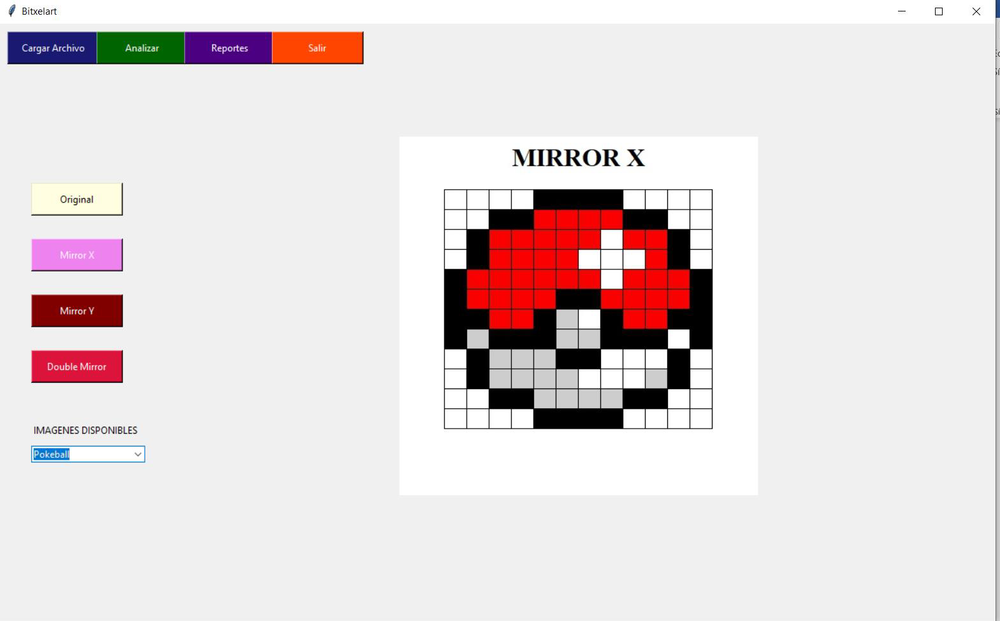

# BITXELART PROYECTO 1 LENGUAJES FORMALES Y DE PROGRAMACIÓN

## Al iniciar la aplicación se mostrará una interfaz con las siguientes opciones.

## Cargar Archivo
### Esta función abre el explorador de archivos y permite seleccionar el archivo para analizarlo, la extensión del archivo debe de ser pxla.
___
## Analizar
### Esta opción analiza el archivo y genera los archivos con extensión html y jpg para poder visualizarlos en las 2 extensiones.
___
## Reportes
### Esta opción abre los reportes de Tokens y Errores generados en el archivo de la imagen que esté seleccionada.
___
## Salir
Cierra la aplicación.
___
## Original:
### Una vez cargados y analizados los archivos necesarios se podrá elegir la imagen que se desea visualizar (en la parte inferior izquierda se muestra una lista con las imágenes disponibles).

## MIRRORX
### Esta opción gira horizontalmente la imagen original.

## MIRRORY
### Esta opción gira verticalmente la imagen original.

## DOUBLEMIRROR
### Esta opción gira horizontalmente y verticalmente la imagen original.

### Si se elige un filtro que no viene en el archivo de entrada se mostrará el siguiente error.

